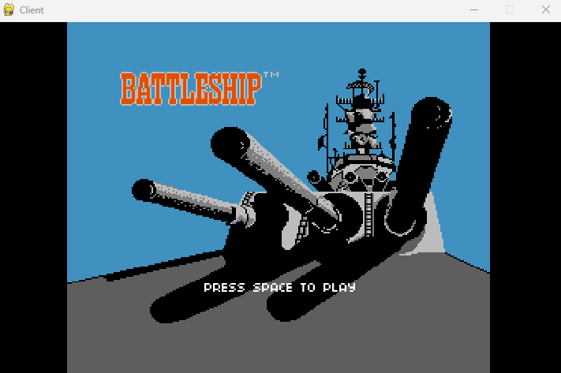
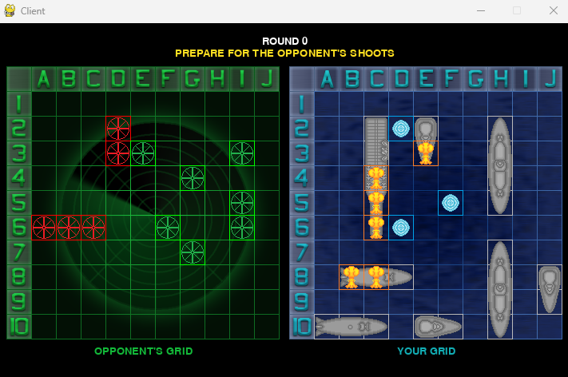
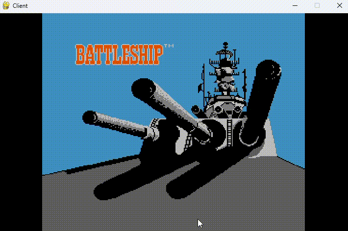

# Multiplayer Battleship Game

<table>
  <tr>
    <td></td>
    <td></td>
  </tr>
</table>

A Battleship game made with python, using pygame and socket.

---

### Prerequisites

Before you begin, ensure you have met the following requirements:

Python 3.x installed. You can download it from [python.org](python.org).

### Installation

Clone the repository to your local machine:

```shell
git clone https://github.com/ThiagoORuby/Network-Battleship-Pygame.git
cd Network-Battleship-Pygame
```

Create a virtual environment and activate it:

```shell
python -m venv venv
source venv/bin/activate  # On Windows, use `venv\Scripts\activate`
```

Install the required dependencies:

```shell
pip install -r requirements.txt
```

### How to Play

To play the game, first run the server:

```shell
python server.py
```

And, in another terminal, run the game using the following command:

```shell
python client.py
```

Follow the on-screen instructions to start playing.



- **Red Token:** shot on a ship
- **Gren Token:** shot in the water

### License
This project is licensed under the MIT License - see the LICENSE file for details.


